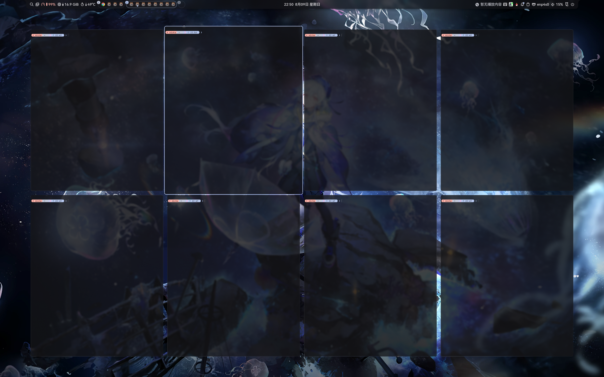
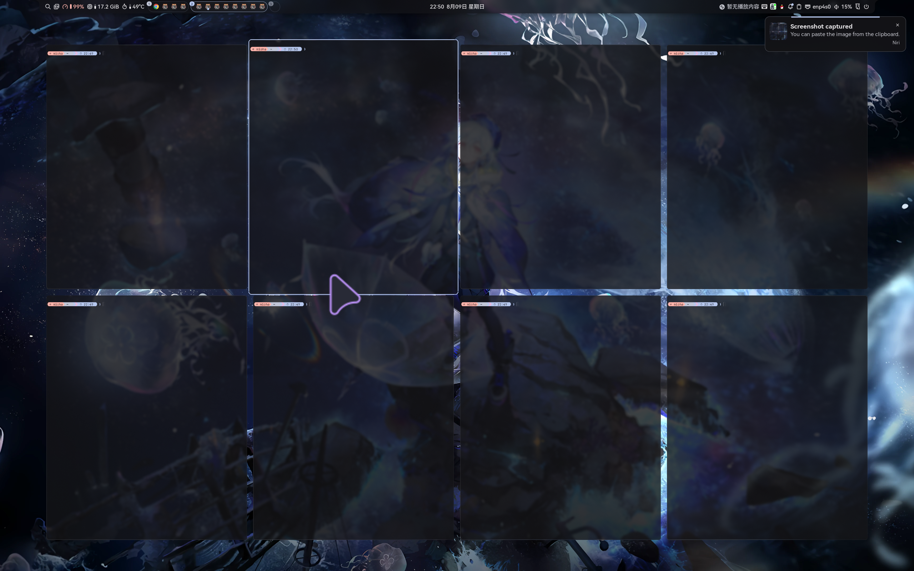
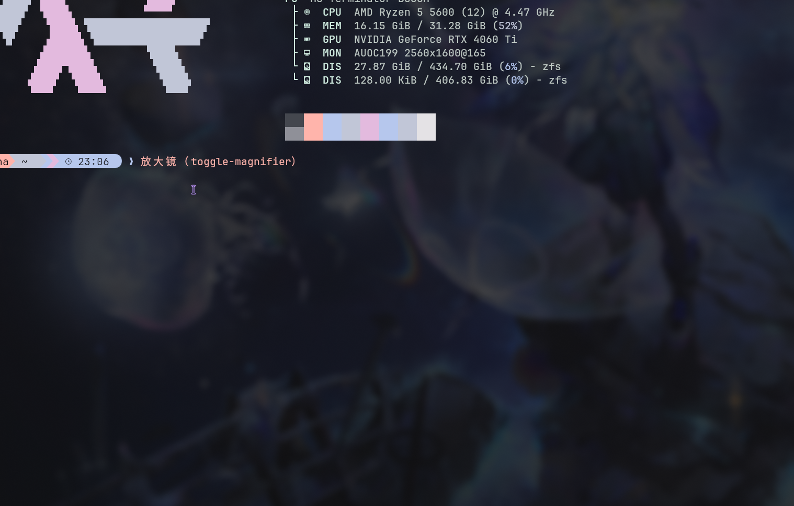

# Liquid Glass Effect for Niri

**[中文](README.md)** | **[English](README.en.md)**

## Examples

1.

  

2.


3.


4.


5.


## SHORiN-KiWATA fork features

Additional features from the [SHORiN-KiWATA/niri](https://github.com/SHORiN-KiWATA/niri) fork:

1. Grid overview

   

   The Mod-tap trigger is no longer built in: it works through the regular `Mod repeat=false { toggle-grid-overview; }` binding in `binds`, just like the magnifier below, so you can rebind or remove it freely.

2. Shake mouse pointer to zoom

   

3. Magnifier

   

## Files

### Shader

- `src/render_helpers/shaders/clipped_surface.frag` - Main liquid glass effect shader (based on [kwin-effects-glass](https://github.com/4v3ngR/kwin-effects-glass))

### Rust (rendering)

- `src/render_helpers/liquid_glass.rs` - `LiquidGlassOptions` struct with effect parameters
- `src/render_helpers/background_effect.rs` - Liquid glass integration with background effect
- `src/render_helpers/framebuffer_effect.rs` - Uniform passing to shader (windows)
- `src/render_helpers/xray.rs` - Uniform passing to shader (xray)
- `src/render_helpers/shaders/mod.rs` - Uniform registration during shader compilation
- `src/render_helpers/mod.rs` - Module declaration for liquid_glass

### Niri Config

- `config.kdl` - Example configuration with liquid-glass enabled

## How to Apply

### Nix / NixOS (flake)

This repo ships a flake that builds niri with the liquid-glass overlay applied
on top of the [SHORiN-KiWATA/niri](https://github.com/SHORiN-KiWATA/niri) fork,
packaged the same way as [shorin-niri-nix](https://github.com/yigexuanmu/shorin-niri-nix).
No manual file copying or `install.sh` needed.

#### 1. Add the input to your flake

```nix
{
  inputs = {
    nixpkgs.url = "github:NixOS/nixpkgs/nixos-unstable";
    niri-glass.url = "github:yigexuanmu/Niri-glass";
  };

  outputs = { self, nixpkgs, niri-glass, ... } @ inputs: {
    # ...
  };
}
```

#### 2. Install on your system

Replace the stock niri with niri-glass through `programs.niri`:

```nix
programs.niri = {
  enable = true;
  package = inputs.niri-glass.packages.x86_64-linux.default;
};
```

Then `sudo nixos-rebuild switch`.

Alternatively, use the bundled NixOS module, which reuses the niri
session/portal/polkit wiring:

```nix
{
  imports = [ inputs.niri-glass.nixosModules.default ];
  programs.niri-glass.enable = true;
}
```

home-manager:

```nix
{
  imports = [ inputs.niri-glass.homeManagerModules.default ];
  programs.niri-glass = {
    enable = true;
    # optional: manage ~/.config/niri/config.kdl
    config = builtins.readFile ./niri/config.kdl;
  };
}
```

Or use the overlay (`overlays.default` exposes `pkgs.niri-glass`), or reference
`inputs.niri-glass.packages.<system>.niri-glass` anywhere a package is expected.

Quick try-out (no install):

```bash
nix run github:yigexuanmu/Niri-glass          # run the compositor
nix shell github:yigexuanmu/Niri-glass        # drop niri-glass into a shell
nix develop github:yigexuanmu/Niri-glass      # dev shell (rust + niri build deps)
nix build  github:yigexuanmu/Niri-glass       # build, result at ./result
```

> The flake is pinned to a specific SHORiN-KiWATA/niri revision the overlay files
> were written against. If you bump the `shorin-niri` input, refresh the overlay
> files (`src/render_helpers/*`, `niri-config/src/appearance.rs`) to match or the
> build may fail to compile.

### install.sh (non-Nix)

Clone the official repo and this one and run the install script:

```bash
git clone https://github.com/niri-wm/niri
git clone https://github.com/yigexuanmu/Niri-glass
cd Niri-glass
```

```bash
./install.sh 
```
This will create a new wayland session. You will be able to choose in your login manager.

### Manual steps

1. Copy files to your niri `src/` directory
2. Run `cargo build --release` in the niri source
3. Copy `target/release/niri` to `/usr/bin/local/niri-glass` (requires sudo)

## Configuration

### Example with all parameters


In `config.kdl`:

```kdl
window-rule {
    match app-id =".*"
    background-effect {
        blur true
        xray true
        liquid-glass {
            refraction-strength 3.0
            power-factor 10
            refraction-power 1.0
            glow-weight 0.0001
            edge-lighting 0.2
            saturation 0.9
            vibrancy 0.2
            adaptive-dim 0.2
            adaptive-boost 0.2
            physical-refraction 0
            lens-distortion 0
            fringing 0

        }
    }
}
```

### Parameters for a frosted glass look

```kdl
saturation 0.9
vibrancy 0.2
adaptive-dim 0.25
adaptive-boost 0.25
```


With all parameters set to 0 (except saturation, which is set to 1):

 ```

### others

- fringing:
  this make rgb colors appear

  

- edge-lightning

  this make the wallpapers colors blend with the edges


## More examples

### Interaction with live wallpaper with shadows enabled

https://github.com/user-attachments/assets/4fceeaaf-4ff1-4c4d-adcf-af52cd33a912

### With xray set to false


## Warnings
- Tested in the 26.04 version
- newer versions may conflict with this.
- Vibe coded project so expect weirdly behavior.
  
